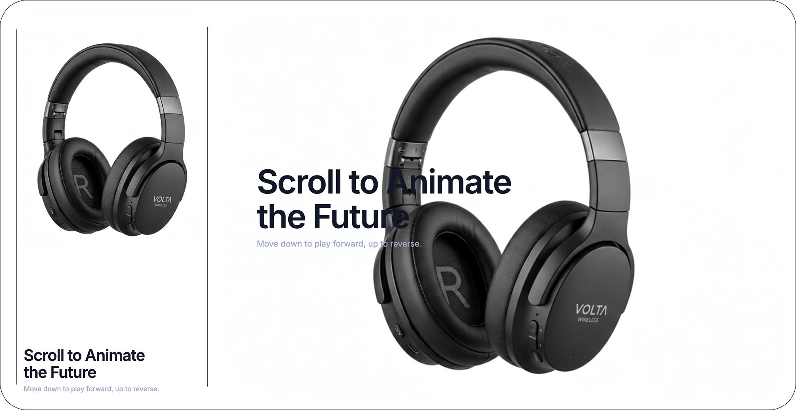
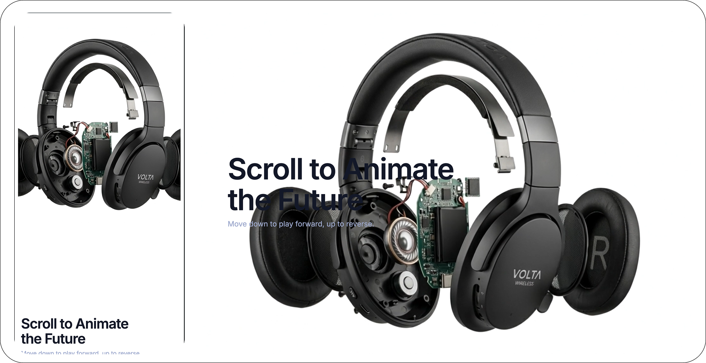

# AI 3D Scroll Experience

An interactive, cinematic landing experience where scroll controls a high-quality video timeline, then seamlessly transitions into product storytelling sections designed for conversion.

## Product Story

This project is built like a premium web campaign:
- **Scroll-driven hero animation** with smooth frame scrubbing and responsive timing
- **Narrative transitions** from immersive media into clean sales-focused sections
- **Desktop + mobile optimization** with dedicated layout tuning and parallax behavior
- **Presentation-first UI** that feels polished, modern, and launch-ready

## What Was Built with AI

This experience was crafted with a multi-model AI production workflow:
- **Claude** - architecture decisions, implementation guidance, interaction logic, and front-end engineering iterations
- **Nanobanana** - concept shaping, creative direction support, and visual storytelling refinements
- **Kling AI** - source motion/video generation used as the core animated media layer

Together, these tools accelerated ideation-to-delivery and made it possible to ship a high-end interactive demo fast.

## Screenshots

### 1

### 2

## Tech

- HTML5
- CSS3 (responsive + animation/parallax styling)
- Vanilla JavaScript
- Three.js (video texture rendering path)

## Positioning

If you need a website section that sells innovation in the first seconds, this is exactly that: motion-led, conversion-oriented, and production-ready.
